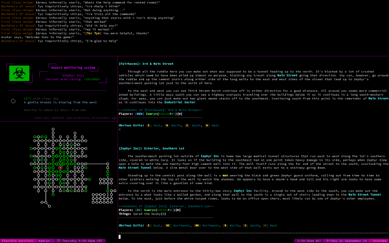
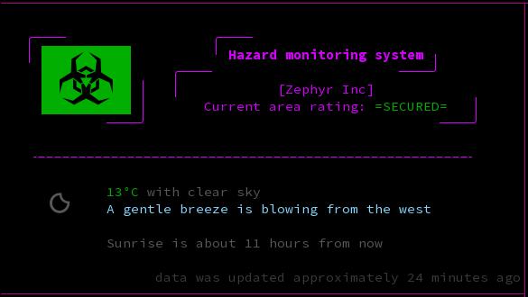

# Flexible Survival Scripts
A collection of scripts that use tintin++ and tmux to provide a nice UI for the Flexible Survival MUD, with four panes for chat, status, a map, and main content. No commands are sent to the server - all information is parsed from the server's responses to commands typed by the player, or from external sources such as the [OpenWeatherMap API](https://openweathermap.org/).

Please note that this project is very much still at an early stage, and bugs are to be expected. Please report any problems via the [issue tracker](https://gitlab.com/inutt/flexible-survival-ui/issues).

The chat pane contains messages from channels specified in the config file (see [installation](#Installation)), and the main pane contains the rest of the MUD's output.

The status pane contains information about your character's current location. The hazard level (as per the standard hazard monitor ratings of safe/hazardous/dangerous) is shown in the top area as both a large coloured symbol, and a textual indicator just below the area name. The lower half of the status pane contains weather information, so that the environmental conditions are available at a glance to assist with roleplaying.

Note that hazard level detection requires that your hazard monitor audible alerts are turned on (`+haz unmute`)

The map pane shows the map generated by tintin++'s automapper function. The map will be generated as you move around, but detection of exits relies on the exits being named after compass directions - only `n`, `e`, `s`, `w`, `ne`, `se`, `sw`, `nw`, `u` (up), and `d` (down) will be recognised automatically. Other exits are supported (the `Z` exit to enter the Zephyr Inc front door for example), but will need to be manually connected to the destination room and assigned a direction using the relevant [tintin++ commands](https://tintin.sourceforge.io/manual/map.php). This is a little complex, and will be documented better at some point.

The colour of rooms in the map can be changed by using the commands `mark here safe`, `mark here normal`, and `mark here dangerous` while standing in the room to set the colour to green, white, and red respectively.

The map as shown here also requires a slightly modified version of tintin++ and a custom font. These will be uploaded separately.

At the bottom of the window is a status bar.

The left side shows your character's name, sex (although not currently due to being broken), and in-character time, while the right side shows your local time, date, and hostname.

## Dependencies
  - a terminal that supports 256-colour or truecolour mode, and unicode fonts
  - tintin++
  - tmux
  - bash
  - perl, with these modules:
    - common::sense
    - DateTime
    - DateTime::Event::Sunrise
    - File::ChangeNotify
    - File::Pid
    - Getopt::Long
    - JSON
    - LWP::UserAgent
    - Path::Class
    - Term::ANSIColor
    - Time::Duration
- an [OpenWeatherMap API key](https://home.openweathermap.org/users/sign_up)

Also, these scripts were designed for a linux system. They may work on other operating systems (so long as the dependencies are available), but that is entirely untested.

## Installation

Download the scripts using:  
`git clone https://gitlab.com/inutt/flexible-survival-ui.git ~/fs_mud`  
or similar - feel free to change `~/fs_mud` to whatever directory you want to store the scripts in.

Create the config file using:  
`cp ~/fs_mud/config.json.dist ~/fs_mud/config.json`  
then edit the `config.json` file and fill in your character name, password, and OpenWeatherMap key. You can also customise the list of chat channels that will appear in the chat pane in the "chat_channels" setting in the "fs" section.

Please note that as the config file contains your password in plain text, you should take steps to ensure the file is secure. I recommend `chmod 600 ~/fs_mud/config.json` as a minimum to ensure only your user can access it.

There are other settings in the status/weather section that may be of interest:
  - `units` can be set to metric or imperial to show the temperature and windspeed in degrees celcius and metres per second, or degrees Farenheit and miles per hour, respectively.
  - `precise_wind` can be true or false, where true means to show the wind speed and direction numerically rather than just a text based description.
  - `temperature_threshold_hot` and `temperature_threshold_cold` are the maximum and minimum temperatures your character feels are comfortable. For roleplaying purposes, the status pane will display temperatures inside this range in green to indicate comfortable, temperatures above it in red to indicate your character is too hot and may be sweating or similar, and temperatures below it in blue to indicate your character is cold and may be shivering, etc.
  
These settings are purely to assist in your roleplaying - it does not affect your character in any way, and it remains up to you how your character responds to the environment.

If all goes well, you should now be able to run the `~/fs_mud/flexible_survival` script and connect to the server as your configured character. 
